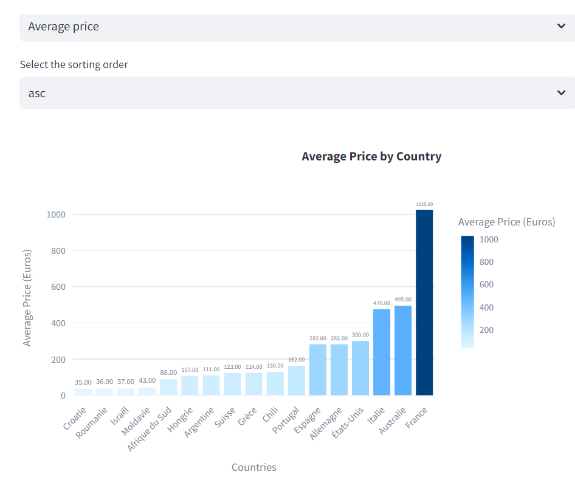
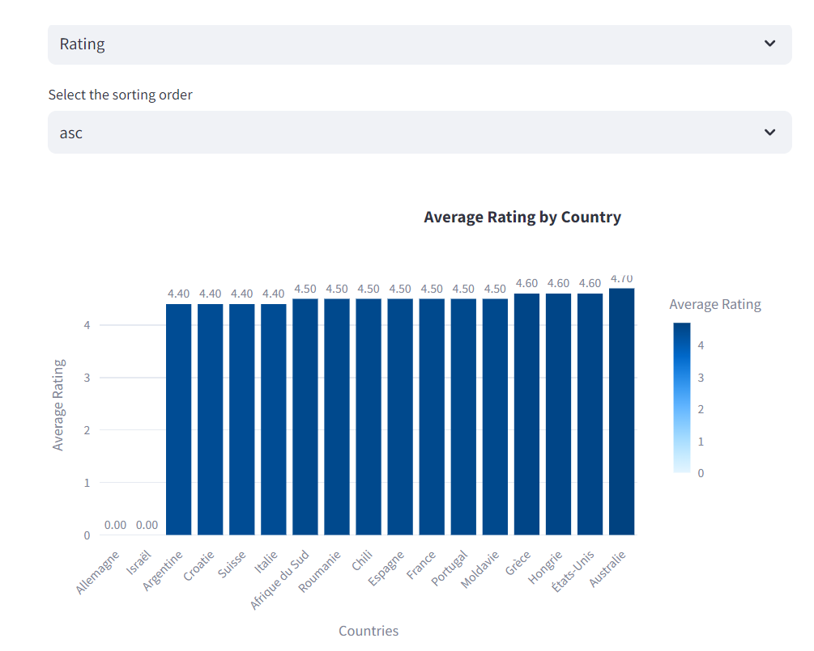
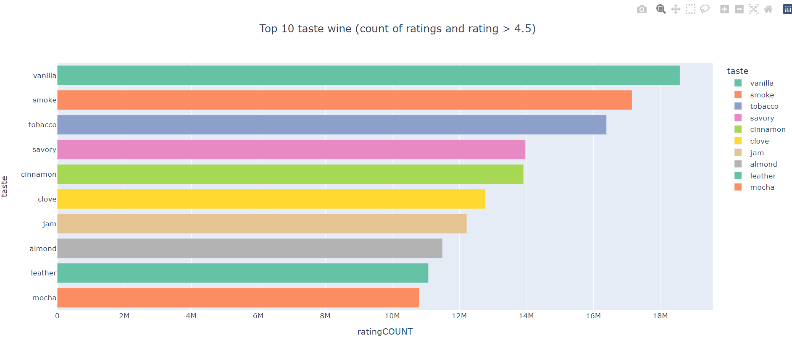
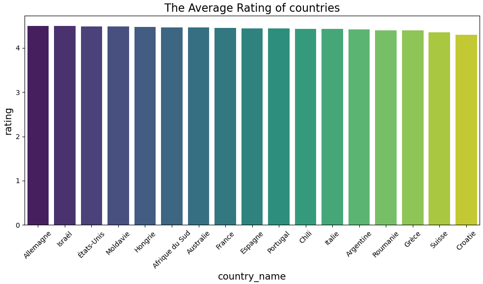
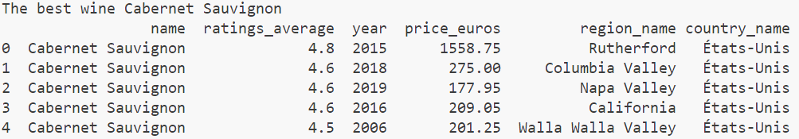
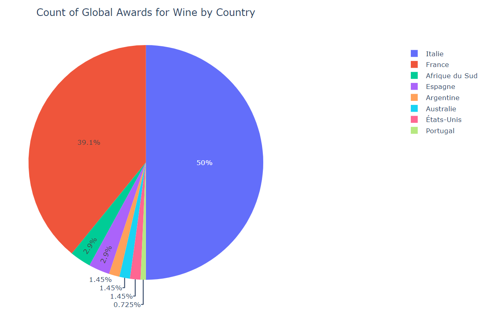

# vinivo_project

We have a limited marketing budget for this year. Which country should we prioritise and why?
(limit_market.py)

We detected that a big cluster of customers likes a specific combination of tastes.(besttaste.py)

We would like to create a country leaderboard. Come up with a visual that shows the **average wine rating for each `country`**. (leaderborder_diagram.py)

One of our VIP clients likes _Cabernet Sauvignon_ and would like our top 5 recommendations. Which wines would you recommend to him? (caberne_advise_csv.py)

Count of global awards for wine by country
